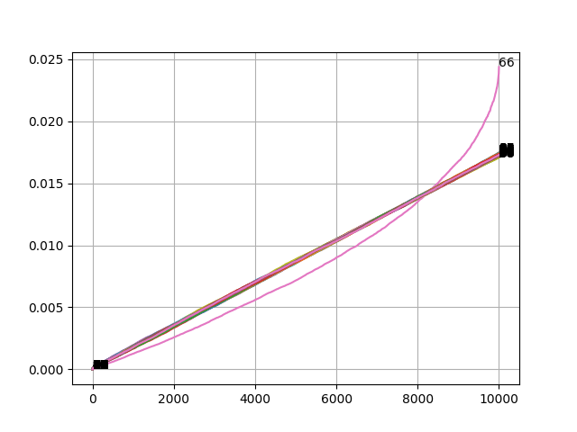

# Analyse nem

From the description we know that something should be odd with one of the columns, so lets find it:

After a bit of trial-and-error we found that the column 66 indexes into the letter column using:

\[
    column_0[ round(column_{66}-1) ]
\]

Running the attached script shows the analysis and then extracts the (very long!) flag:

`nc3{The most merciful thing in the world, I think, is the inability of the human mind to correlate all its contents. We live on a placid island of ignorance in the midst of black seas of infinity, and it was not meant that we should voyage far. H.P. Lovecraft}`

(and then a lot of garbage).