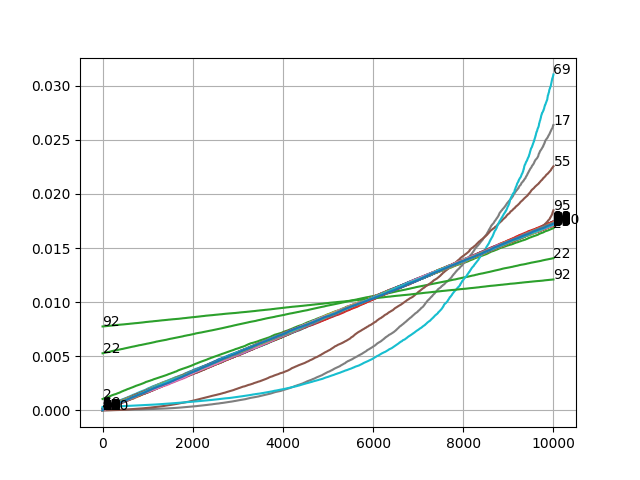

# Analyse svær

Running the same analysis as in "nem" gives:

Based on this we guess the cols we need to combine must be:

* 2
* 17
* 22
* 55
* 69
* 92
* 95

Which is 7, and we need 8...

This would be easy to bruteforce, if we knew how to combine them,
but the index function in 'nem' can be used now, and must attempts
(i.e. mean, sum, etc) gives way to high numbers...
