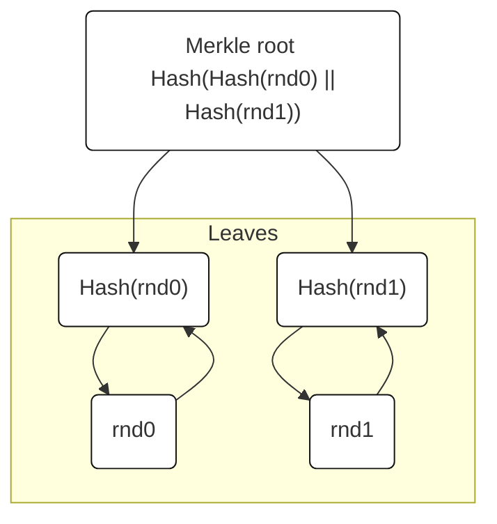
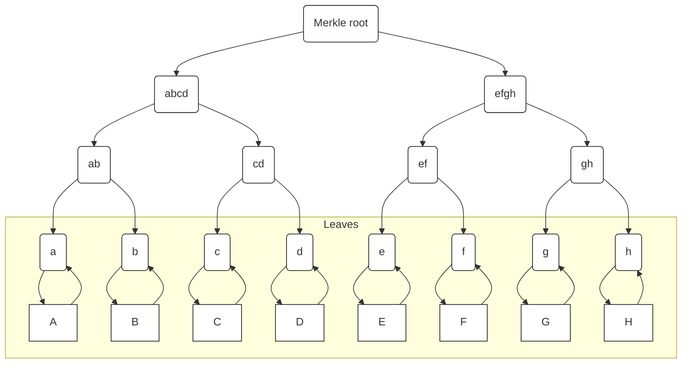
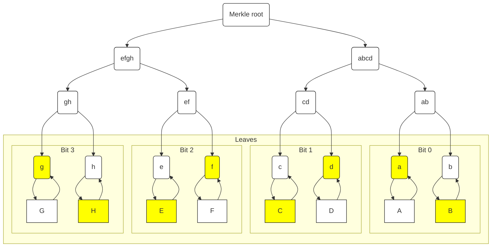
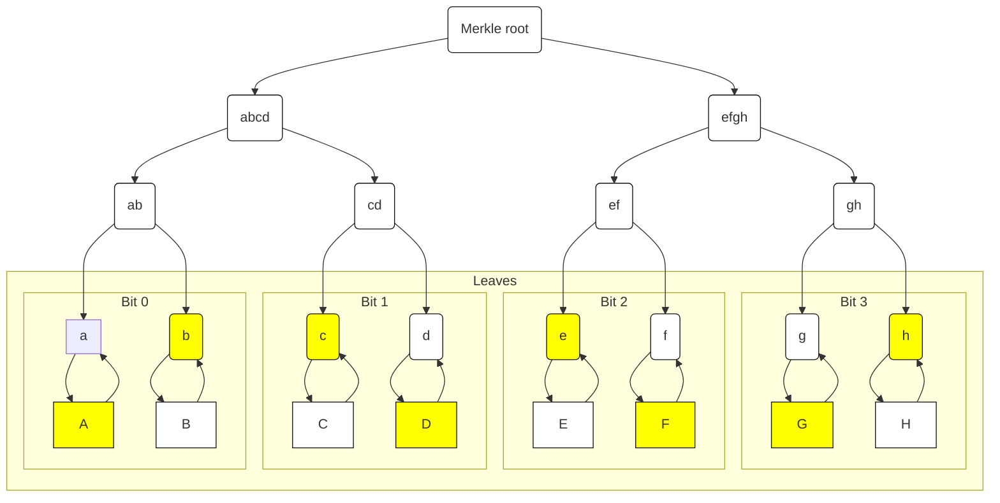

# postquantumsig

_Our hot new cryptocurrency uses powerful techniques to make the asymmetric key signatures just as hard to crack on a quantum computer as a binary one. Maybe we forgot something though? Send some money to a weird address if you get any._

_nc challenges.fbctf.com 8088_

--------------------------------------------------------------

The challenge have some python code attached, but not much description of whats going on.
The included `signatures.csv` contains 77 transactions where people send _zuccoins_ to each other.

From the code (and name) of the challenge we came to conclude that the system implements the **Merkle signature scheme**.

So how does the Merkle signature scheme work?
Well, lets first checkout _Lamport one-time signature scheme_ to sign a single bit.

## Signing a single bit (quantum resistant!)

In the hash based tree below, our public key is the _Merkle root_ and `rnd0` and `rnd1` are some securely big random values.



Now to sign `bit is 0` we will reveal `rnd0` and `Hash(rnd1)` and everyone can calculate `a = Hash(rnd0)` and verify that `root == Hash(a || Hash(rnd1))`.

But note that revealing any of the leaves will mean that we can reuse the signature, i.e. if anyone knows `rnd1` then signatures for both `bit is 0` and `bit is 1` can be forged.

## Signing multiple bits

We can extend the tree and sign multiple messages.



In the above example `a = Hash(A)`, `b = Hash(B)`, ..., `ab = Hash(a || b) = Hash(Hash(A) || Hash(B))`, etc.

We will use `a` and `b` to sign the first bit of the message, then use `c` and `d` to sign bit 2, and so forth.
Again, revealing `A` means `bit is 0` and revealing `B` means `bit is 1`.

To sign `1001` we will need to reveal all the yellow below:



This is all fine, and we can extend the signature scheme to allow for signing multiple messages (in the python code attached, this is the `other` variable).

But when checking `signatures.csv` we found that one of the addresses (`9bca65c9376209ede04b5df3b02cb832f8997ff978069d171dc9cbfca657f91a`) always had a signature merkle hash of `878c9f44e5284cc3b0bd9ade03e5ad023f323f830b2588756ec5ed84ee124fb4`, e.g. he signed multiple different messages using the same one-time signature!

So lets see what happens in the above tree if we sign e.g. `0110`:



Now we can combine the two signatures and will get to know `A`, `B`, `C`, `D`, `E`, `F`, `G`, `H`, i.e. the private key!

We used this to create a signature for:
`9bca65c9376209ede04b5df3b02cb832f8997ff978069d171dc9cbfca657f91a sent 13.37 zuccoins to aaaaaaaaaaaaaaaaaaaaaaaaaaaaaaaaaaaaaaaaaaaaaaaaaaaaaaaaaaaaaaaa`

And volà:

```bash
python3 ./verifier.py | nc challenges.fbctf.com 8088
Enter signed transaction row: 

fb{reduce_reuse_recycle_is_bad_advice_for_ots}
```
