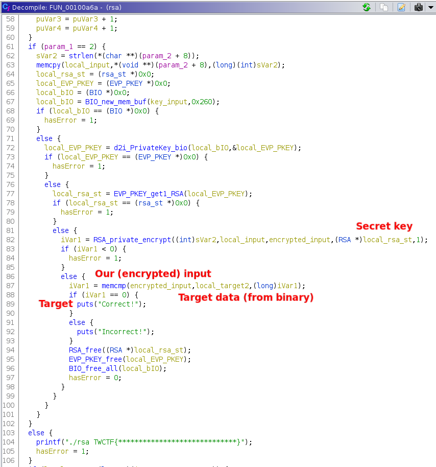

First open the binary in Ghidra and rename the variables.
And you will get something like the following:



We quickly see the target `Correct!`, but simply patching the `memcmp` to return `0` will not work, as the flag is the input that lead to `Correct!`.

The first argument of `memcmp` is our (encrypted) input and the second argument is the target data (i.e. what our input should encrypt to).

Target data and the key used is hardcoded in the binary. They are fairly easy to extract, but the data could as well be the result of some complex computation (e.g. if the binary was obfuscated).

Idea:
 * Hook `RSA_private_encrypt` and save argument 4 (the rsa key)
 * Hook `memcmp` and call `RSA_public_decrypt` with argument 2 and the above key

frida script:

```js
let rsaKey = null,
    guessPtr = null;

const dump = (name, data) => console.log(`=== ${name} ===\n${hexdump(data)}\n===`);

Interceptor.attach(Module.findExportByName(null, 'RSA_private_encrypt'), {
    onEnter: function (args) {
        console.log('input len.:', args[0]);
        console.log('input.....:', args[1].readCString());
        console.log('output ptr:', args[2]); guessPtr = args[2];
        console.log('key.......:', args[3]); rsaKey = args[3];
        // dump("RSA KEY", rsaKey);
        console.log('padding...:', args[4]);
    },
    onLeave: function (retval) {
        console.log(`Size of signature = ${retval}`);  // 0x80
    }
});

const RSA_public_decrypt = new NativeFunction(Module.findExportByName(null, 'RSA_public_decrypt'), 'int', ['int', 'pointer', 'pointer', 'pointer', 'int']);

Interceptor.attach(Module.findExportByName(null, 'memcmp'), {
    onEnter: function (args) {
        this.str = `memcmp(${args[0]}, ${args[1]})`;
        // assert args[0] == guessPtr

        const x = Memory.alloc(0x80);
        RSA_public_decrypt(0x80, args[1], x, rsaKey, 1);
        dump("Flag", x);
    },
    onLeave: function (retval) {
        console.log(`${this.str} = ${retval}`)
        // retval.replace(ptr(0x0));  // this will make it print "Correct"
    }
});
```

Command:

```bash
$ frida -f ./rsa --no-pause --runtime=v8 -l ./crack.js "TWCTF{*****************************}"
     ____
    / _  |   Frida 12.10.4 - A world-class dynamic instrumentation toolkit
   | (_| |
    > _  |   Commands:
   /_/ |_|       help      -> Displays the help system
   . . . .       object?   -> Display information about 'object'
   . . . .       exit/quit -> Exit
   . . . .
   . . . .   More info at https://www.frida.re/docs/home/
Spawned `./rsa TWCTF{*****************************}`. Resuming main thread!
Incorrect!
input len.: 0x24
input.....: TWCTF{*****************************}�
output ptr: 0x7ffe6c161760
key.......: 0x5594d6ea2930
padding...: 0x1
Size of signature = 0x80

Err?: 28
=== Flag ===
               0  1  2  3  4  5  6  7  8  9  A  B  C  D  E  F  0123456789ABCDEF
7fcc577aa060  54 57 43 54 46 7b 52 69 76 65 73 74 5f 53 68 61  TWCTF{Rivest_Sha
7fcc577aa070  6d 69 72 5f 41 64 6c 65 6d 61 6e 7d 00 00 00 00  mir_Adleman}....
7fcc577aa080  00 00 00 00 00 00 00 00 00 00 00 00 00 00 00 00  ................
7fcc577aa090  00 00 00 00 00 00 00 00 00 00 00 00 00 00 00 00  ................
7fcc577aa0a0  00 00 00 00 00 00 00 00 00 00 00 00 00 00 00 00  ................
7fcc577aa0b0  00 00 00 00 00 00 00 00 00 00 00 00 00 00 00 00  ................
7fcc577aa0c0  00 00 00 00 00 00 00 00 00 00 00 00 00 00 00 00  ................
7fcc577aa0d0  00 00 00 00 00 00 00 00 00 00 00 00 00 00 00 00  ................
7fcc577aa0e0  90 00 00 00 00 00 00 00 01 01 00 00 00 00 00 00  ................
7fcc577aa0f0  f0 74 7a 57 cc 7f 00 00 f0 74 7a 57 cc 7f 00 00  .tzW.....tzW....
7fcc577aa100  00 00 00 00 00 00 00 00 00 00 00 00 00 00 00 00  ................
7fcc577aa110  00 00 00 00 00 00 00 00 00 00 00 00 00 00 00 00  ................
7fcc577aa120  50 8a 7a 57 cc 7f 00 00 f8 91 0c 66 ce 7f 00 00  P.zW.......f....
7fcc577aa130  65 73 73 69 6f 6e 2f 31 00 39 3e 66 ce 7f 00 00  ession/1.9>f....
7fcc577aa140  30 00 00 00 00 00 00 00 52 00 00 00 00 00 00 00  0.......R.......
7fcc577aa150  00 00 00 00 00 00 00 00 00 00 00 00 00 00 00 00  ................
===
memcmp(0x7ffe6c161760, 0x7ffe6c161480) = 0xfffffff8
Process terminated
[Local::rsa]->                                    

Thank you for using Frida!
```
