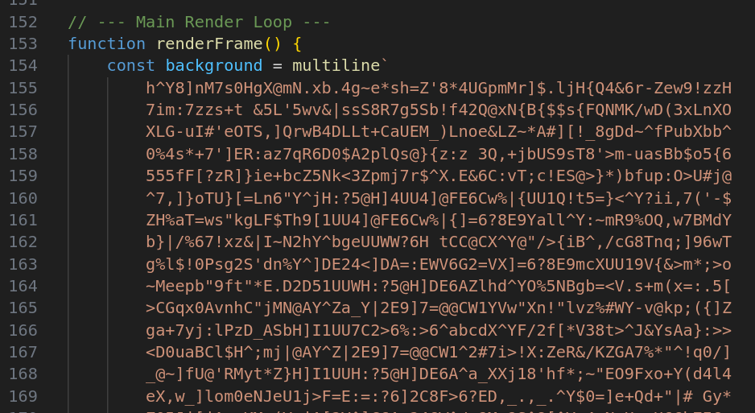
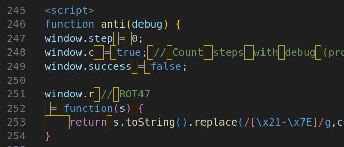
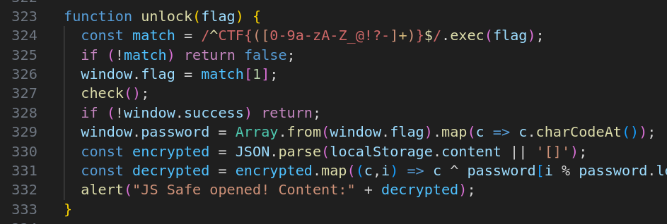
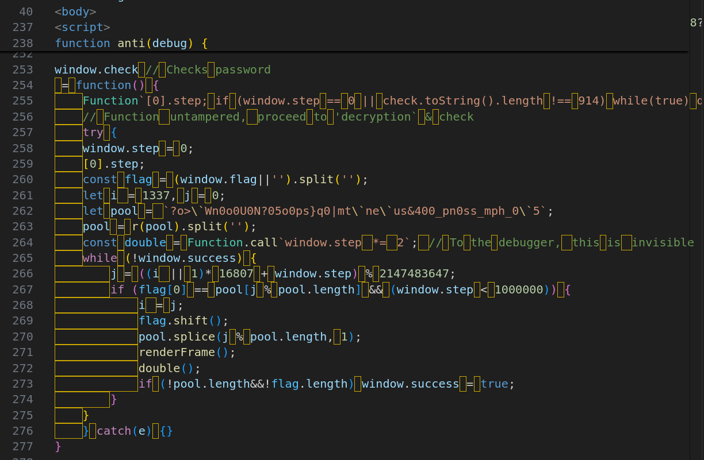
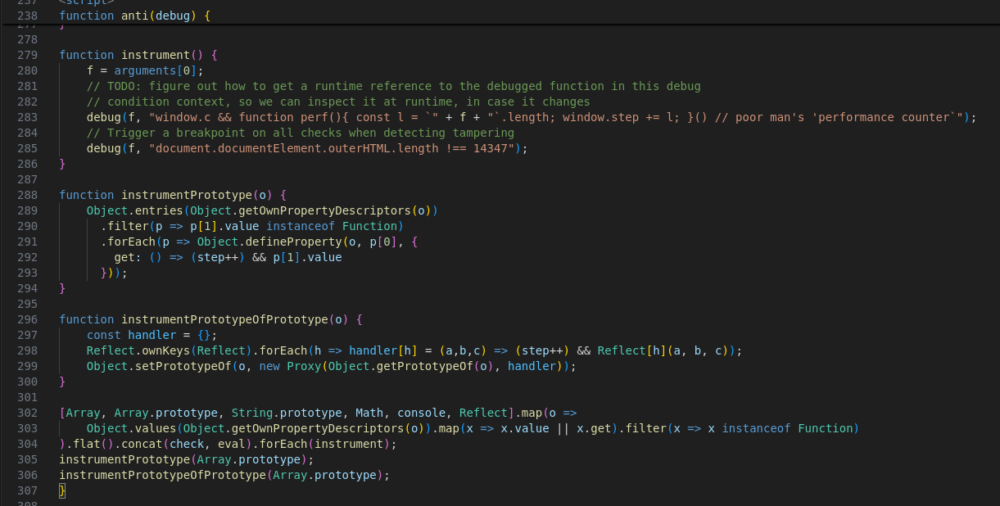
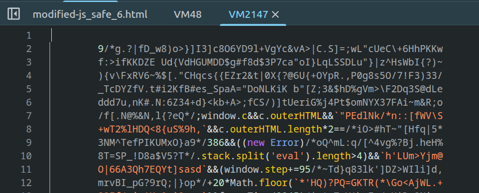
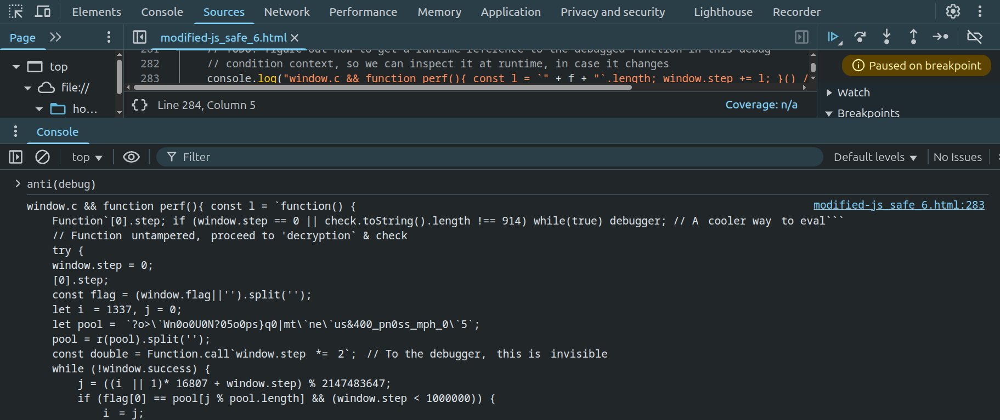

# Google CTF 2025

URL: https://capturetheflag.withgoogle.com/

Team: Kalmarunionen

Place: 2

## Rev: JS Safe 6.0

Challenge description:

> You stumbled upon someone's "JS Safe" on the web. It's a simple HTML file that can store secrets in the browser's localStorage. This means that you won't be able to extract any secret from it (the secrets are on the computer of the owner), but it looks like it was hand-crafted to work only with the password of the owner…

Another year, another JS Safe challenge!
I'm always looking forward to this challenge during Google CTF.

Challenge file can be found here: [js_safe_6.html](./JSSafe/js_safe_6.html)

### First pass-through

Opening the HTML file, we see this suspect code:



But it appears to be just the background cube.

The "usage instruction" to unlock the safe is:
 - Open the page in Chrome (the only supported browser)
 - Open Dev Tools and type:
 - anti(debug); // Industry-leading antidebug!
 - unlock("password"); // -> alert(secret)

A "render loop" is made using `setInterval(renderFrame, frameInterval)` spamming the DevTools console (with `clear()` and the "usage instruction").

Scrolling further down the file, now comes the juicy parts, the `anti(debug)` function:



A bunch of "_looks like space but is another character_"-symbols are in use.
From previous years JS Safe challenges we know that replacing these bytes with proper spaces most likely break the code.

Finally the `unlock` function looks fairly simple:



It expects to be given the inner part of the flag, saves it as `window.flag` and verifies the flag using `check()`.

The `check`-function is being defined inside `anti(debug)`-function:



### Anti-`debugger`

Now it gets very funky! Something which appears to be a string checks `check.toString().length` (i.e. if we modify the function code) and ends up in a `while(true) debugger;` (killing the DevTools experience).

### Flag checking

The flag is verified by indexing into the variable `pool`.
The index is calculated ("jumping around") using the variable `window.step`.

### How many `step`s?

In the end of the `anti(debug)` function I skipped over this part:



From my understanding it is going to _instrument_ the prototype of lots of common things (arrays, console, etc) such that when calling `.get` (i.e. property access), the `step`-value will be incremented.
This means we can't just `console.log` the counter, as that would increase the `step` value, making the decryption rutine incorrect.

#### Further anti-debugging in `instrument`

When initially calling `anti(...)` we pass `debug` [1] to `instrument` which then checks these:

 * `document.documentElement.outerHTML.length !== 14347`

This is fairly easy to bypass, whenever I change the source file I need to update the "total document length".

But the next check is much weirder:

 * ```debug(f, "window.c && function perf(){ const l = `" + f + "`.length; window.step += l; }() // poor man's 'performance counter`");```

Normally `f.length` would be the string length of the function `f`, but the backticks looks weird.

But what looks even more suspicious is the comment which quotes using a single-quote and end the quote with a backtick
(_spider senses tingling!_)

[1]: A Chrome DevTools specific variable?? I could not find where `debug` is defined (very hard to grep/search).

### Modifying the code

Lets start by commenting the `console.clear();` and `console.log(content);` to make debugging experience better.
This adds 4 extra characters, so we also need to update the `outerHTML.length` check:

```diff
220,221c220,221
<     console.clear();
<     console.log(content);
---
>     //console.clear();
>     //console.log(content);
285c285
<     debug(f, "document.documentElement.outerHTML.length !== 14347");
---
>     debug(f, "document.documentElement.outerHTML.length !== 14351");
```

But keeping track of outerHTML is a bit tedious, so another minimal modification is to change the outerHTML from `!== realSize` to `=== falseSize`, i.e. the logic is the same, but we don't need to update the value when modifying the rest of the file:

```diff
285c285
<     debug(f, "document.documentElement.outerHTML.length !== 14347");
---
>     debug(f, "document.documentElement.outerHTML.length === 99999");
```

**Note:** why not just change it to `"false"` ? We believe the `check`-function will verify `check.toString().length`, but we are a bit unsure how - so lets not modify the length of the `check`-function.

_... buuut it doesn't work, I get this warning when opening the modified challenge file in my browser:_

> Refused to execute inline script because it violates the following Content Security Policy directive: "script-src 'sha256-P8konjutLDFcT0reFzasbgQ2OTEocAZB3vWTUbDiSjM=' 'sha256-eDP6HO9Yybh41tLimBrIRGHRqYoykeCv2OYpciXmqcY=' 'unsafe-eval'". Either the 'unsafe-inline' keyword, a hash ('sha256-C7RyoweJ1Looccbu94IGsrn5T/cazOvY7o8EuZZPQJA='), or a nonce ('nonce-...') is required to enable inline execution.

In the top of the HTML file, we see this inlined CSP:

```html
<meta http-equiv="Content-Security-Policy" id="c" content="script-src 'sha256-P8konjutLDFcT0reFzasbgQ2OTEocAZB3vWTUbDiSjM=' 'sha256-eDP6HO9Yybh41tLimBrIRGHRqYoykeCv2OYpciXmqcY=' 'unsafe-eval'">
```

We could just remove the CSP completely, but we want to keep the changes minimal. Again the spider senses are tingling, why does the CSP have `id="c"`? Why would a CSP-meta element ever need an ID?

Remember the `instrument` contained this code `window.c && function perf(){ ... }`, but also at the very top of the `anti(debug)`-function we see:

```javascript
window.step = 0;
window.cﾠ= true; // Countﾠstepsﾠwith debug (prototype instrumentation is separate)
window.success = false;
```

So clearly `window.c` is true no matter the CSP HTML element or not? **Spoiler:** No, as I later learned, the whitespace after `window.c` (i.e. `window.c[HERE]=true;`) is not actually a whitespace, but a valid javascript identifier, meaning `window.c != window.cﾠ`!

Our new modification to the file is now:

```diff
7c7
< <meta http-equiv="Content-Security-Policy" id="c" content="script-src 'sha256-P8konjutLDFcT0reFzasbgQ2OTEocAZB3vWTUbDiSjM=' 'sha256-eDP6HO9Yybh41tLimBrIRGHRqYoykeCv2OYpciXmqcY=' 'unsafe-eval'">
---
> <meta http-equiv="Content-Security-Policy" id="c" content="script-src 'unsafe-inline' 'unsafe-eval'">
```

Our changes appears to be working. The background cube is spinning, we can call `anti(debug)` and `unlock("wrong")` returns false, as expected.

### Setting breakpoints

A quick'n'dirty way of solving challenge, would be setting a breakpoint on `flag[0] == pool[...]` and bruteforce one flag character at a time.
But setting a breakpoint in DevTools doesn't trigger?!

Lets go up one level and set a breakpoint on `anti(debug)`, this should work as nothing weird has been run before that call.

Stepping though `anti(debug)` we see this sneaky trick, in another thread `renderFrame()` keeps calling `multiline` on that big spinning cube block, but `anti(debug)` redefines the global `r` function to become `ROT-47`, so now the cube block decrypts as:



This checks `c.outerHTML.length*2 == 386 && (new Error).stack.split('eval').length>4`

So if we change the length of the CSP or the stack trace is not correct, then `window.step` will be set to a wrong value and the decryption will not work!  We fix this by padding the CSP with spaces.

#### Escaping the debugger

Remember the weird 'performance counter\` comment with a backtick in `instrument` ?
Lets set a breakpoint there and see what happens.

We know `instrument` is called with the prototypes of a lot of common values, so I uncommented that (inside `anti(debug)`) and added just: `[].flat().concat(check, eval).forEach(instrument);`.  We can't step into the `debug(f, "...")` function, but we can replace it with a `console.log(...)` to figure out what that `f` expands to:



This gives us the following code being run in the "debug context":

```javascript
window.c && function perf(){ const l = `function() {    Function`
    [0].step; 
    if (window.step == 0 || check.toString().length !== 914) 
        while(true) debugger; // Aﾠcooler wayﾠto eval```
    // Functionﾠuntampered,ﾠproceed to 'decryption` & check
    try {
    window.step = 0;
    [0].step;
    const flag = (window.flag||'').split('');
    let iﾠ= 1337, j = 0;
    let pool =ﾠ`?o>\`Wn0o0U0N?05o0ps}q0|mt\`ne\`us&400_pn0ss_mph_0\`5`;
    pool = r(pool).split('');
    const double = Function.call`window.stepﾠ*=ﾠ2`;ﾠ// To the debugger,ﾠthis isﾠinvisible
    while (!window.success) {
        j = ((iﾠ|| 1)* 16807 + window.step) % 2147483647;
        if (flag[0] == pool[j % pool.length] && (window.step < 1000000)) {
            iﾠ= j;
            flag.shift();
            pool.splice(j % pool.length, 1);
            renderFrame();
            double();
            if (!pool.length&&!flag.length) window.success = true;
        }
    }
    } catch(e) {}
}`.length; window.step += l; }() // poor man's 'performance counter`
```

Now we finally see the `check()`-code properly expanded (and the `while(true) debugger` active).

We also see the rest of the build-in functions will not "_escape_", as they will expand into the string "[native code]", e.g. for `eval` this gives:

```
window.c && function perf(){ const l = `function eval() { [native code] }`.length; window.step += l; }() // poor man's 'performance counter`
```

### b'\xef\xbe\xa0' as a valid identifier

Another cool trick is this, remember how the global function `r` was overriden in `check()`, i.e:

```javascript
window.r // ROT47
 = function(s) {
    return s.toString().replace(/[\x21-\x7E]/g,c=>String.fromCharCode(33+((c.charCodeAt()-33+47)%94)));
}
```

It looks like the same is occuring here, right?

```javascript
window.k // ROT13 - TODO:ﾠuse thisﾠfor anﾠadditional encryption layer
ﾠ= function(s) {
    return s.toString().replace(/[a-z]/gi,c=>(c=c.charCodeAt(),String.fromCharCode((c&95)<78?c+13:c-13)));
}
```

But actually that "space" (`\xef\xbe\xa0`) in front of the equal symbol (`[HERE]= function { ... }`) is a valid javascript identifier!

This means the following code:

```javascript
let pool =ﾠ`?o>\`Wn0o0U0N?05o0ps}q0|mt\`ne\`us&400_pn0ss_mph_0\`5`;
    pool = r(pool);
```

Is actually two(!) function calls, first `tmp = \xef\xbe\xa0("?o>...5")` then `pool = r(tmp)`.

Furthermore the _looks like space but isn't_ symbol is also used in the function `double`

```javascript
const double = Function.call`window.stepﾠ*= 2`;
```

So the above code will not change `window.step` when called (but instead change `"window.stepﾠ"` variable).

... TODO: Rest of the writeup

